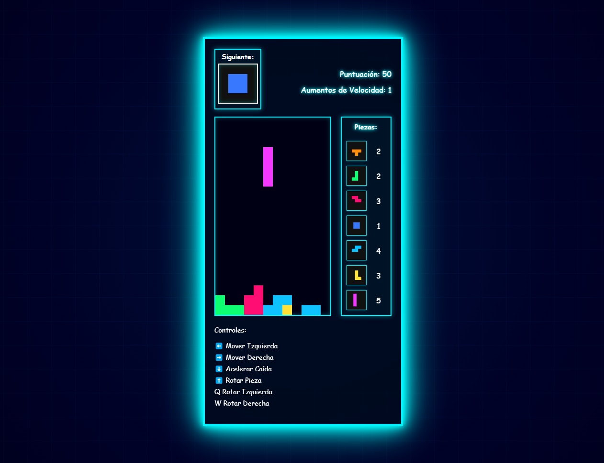

# 🎮 Tetris Estilo Tron

Un juego de Tetris clásico implementado en JavaScript con un diseño visual neón inspirado en la película Tron. Incluye efectos visuales, sistema de puntuación, y estadísticas de piezas.

## 🚀 Características

- 💫 Diseño visual con efectos de neón y estilo Tron
- 🎨 Animaciones y efectos de iluminación
- 📊 Estadísticas detalladas de piezas usadas
- 🔄 Vista previa de siguiente pieza
- ⚡ Sistema de velocidad progresiva
- 📱 Diseño responsivo
- 🏆 Sistema de puntuación

## 🎯 Cómo Jugar

### Controles
- ⬅️ Flecha Izquierda: Mover pieza a la izquierda
- ➡️ Flecha Derecha: Mover pieza a la derecha
- ⬇️ Flecha Abajo: Acelerar caída
- ⬆️ Flecha Arriba: Rotar pieza (sentido horario)
- Q: Rotar pieza (sentido antihorario)
- W: Rotar pieza (sentido horario)
- ESPACIO: Reiniciar juego (tras Game Over)

### Sistema de Puntuación
- Una línea: 10 puntos
- Líneas consecutivas: Puntos duplicados
- Cada 5 líneas: Aumento de velocidad

## 🛠️ Tecnologías

- HTML5 Canvas para renderizado
- JavaScript vanilla para la lógica
- CSS3 con animaciones
- Sin dependencias externas

## 📊 Características Técnicas

- Generación procedural de piezas
- Sistema de colisiones
- Rotación de piezas con ajuste de colisión
- Contadores individuales por tipo de pieza
- Efectos visuales mediante CSS

## 🎨 Diseño

- Tema visual inspirado en Tron
- Efectos de neón y resplandor
- Animaciones suaves
- Retroalimentación visual
- Paleta de colores neón

## 🔧 Instalación

- El juego es 100% Front-End y no requiere ninguna dependencia. Descargar y abrir index.html en el navegador.
